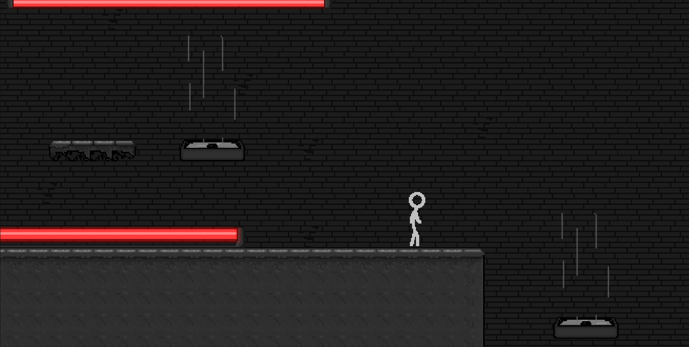

<div align="center">

# 💻 Rebooted

<a href="https://rebooted-univali.vercel.app/"></a>

</div>
**Um jogo de plataforma 2D onde você é um ponteiro de memória perdido dentro de um computador corrompido**

## 📖 Sobre

Rebooted é um jogo de plataforma 2D em pixel art que mistura ação, puzzles lógicos e narrativa. Inspirado em "Animator vs. Animation", você controla um ponteiro de memória que ganhou consciência após uma falha crítica no sistema.

Explore as profundezas de um computador corrompido, enfrentando cada componente de hardware como uma fase única com mecânicas próprias e desafios temáticos.

## 🎮 Características

- Pixel art retrô com efeitos de glitch
- Puzzles baseados em conceitos de programação
- 4 fases únicas representando componentes do computador
- Sistema de progressão com fragmentos de código colecionáveis
- Múltiplos finais baseados nas escolhas do jogador

## 🗺️ Fases

### Fan Chamber
Câmara da ventoinha. Domine correntes de ar e plataformas flutuantes enquanto enfrenta o *Overheat Drone*.

### Hard Disk Depths
Profundezas do HD. Sincronize movimentos com discos giratórios e evite *Bad Sectors* que apagam o cenário.

### Power Core
Fonte de energia. Redirecione correntes elétricas e sobreviva a descargas perigosas.

### CPU Core
Núcleo da máquina. Enfrente o *Glitch Prime*, sua própria cópia corrompida, e escolha o destino do sistema.

## 🕹️ Jogabilidade

### Controles
- Movimento: WASD / Setas
- Pulo: Espaço
- Interação: E
- Modo Debug: Tab

### Como rodar o projeto
```bash
# Clone o repositório
git clone https://https://github.com/mapompeo/rebooted

# Entre no diretório
cd rebooted

# Abra o projeto no Unity Hub
# File > Open > Selecione a pasta do projeto
```

### Primeira execução
1. Abra o Unity Hub
2. Clique em "Add" e selecione a pasta do projeto
3. Abra o projeto
4. Aguarde a importação dos assets
5. Abra a cena principal em `Assets/Scenes/MainMenu.unity`
6. Pressione Play para testar
